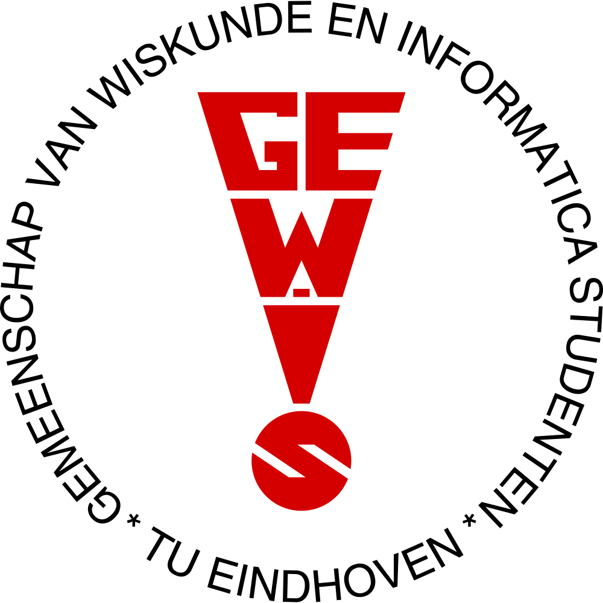

# GEWIS Remote Desktop for macOS

A native macOS app for connecting to the GEWIS virtual desktop.
Built with [Tauri 2](https://v2.tauri.app/) (Rust + WKWebView) and a
custom FreeRDP build with Kerberos enabled.

<p align="center">
  
</p>

## Why this exists

- The **Microsoft Remote Desktop** app on macOS fails with error `0x3707`
  because the GEWIS RD Gateway requires Kerberos, and the Microsoft client
  on macOS only speaks NTLM.
- The **Homebrew FreeRDP bottle** is compiled with `WITH_KRB5=OFF` on macOS,
  so it cannot use a Kerberos ticket either.

This app ships a pre-built FreeRDP with `WITH_KRB5=ON`, hardware H.264
decode via VideoToolbox, and SDL3+Metal rendering, all bundled inside the
`.app`. On TU/e WiFi it auto-detects that the RDP server is directly
reachable and skips the slow HTTPS gateway, giving Windows-level latency.

---

## Install (end users)

Download the latest **GEWIS Remote Desktop-*.dmg** from the
[Releases](https://github.com/ZiineZ/gewis-rdp/releases) page, then:

1. Install **Homebrew** from [brew.sh](https://brew.sh) if you don't have it.

2. Install MIT Kerberos:
   ```sh
   brew install krb5
   ```

3. Add the GEWIS realm to `/etc/krb5.conf` (needs sudo):
   ```sh
   sudo tee /etc/krb5.conf > /dev/null <<'EOF'
   [libdefaults]
     default_realm = GEWISWG.GEWIS.NL
     rdns = false

   [realms]
     GEWISWG.GEWIS.NL = {
       kdc = https://gewisvdesktop.gewis.nl/KdcProxy
     }
   EOF
   ```

4. Open the downloaded `.dmg`. A volume called **GEWIS RDP Installer**
   mounts on your desktop — that's the installer, not a second app.
   Drag the app icon onto the **Applications** shortcut, then eject the
   installer disk (drag it to Trash, or right-click → Eject).

5. First launch from `/Applications/`. If macOS says "can't be opened",
   clear the quarantine flag once:
   ```sh
   xattr -cr "/Applications/GEWIS Remote Desktop.app"
   ```

### Requirements

- macOS 11 Big Sur or later
- Apple Silicon (M1/M2/M3/M4). Intel Macs not supported by this build

---

## How it works

```
┌──────────────────┐    Kerberos ticket    ┌──────────────────┐
│ GEWIS Remote     │ ────────────────────► │ KDC Proxy        │
│ Desktop.app      │                       │ (HTTPS, GEWIS)   │
│ (Tauri + Rust)   │ ◄──── TGT ──────────  └──────────────────┘
└────────┬─────────┘
         │ spawn
         ▼
┌──────────────────┐                       ┌──────────────────┐
│ sdl-freerdp      │ ◄── on TU/e WiFi ──►  │ RDP server :3389 │
│ (SDL3 + Metal,   │      direct TCP       │ (fast)           │
│  Kerberos build) │                       └──────────────────┘
│                  │
│                  │       off-campus      ┌──────────────────┐
│                  │ ◄────── HTTPS ──────► │ RD Gateway :443  │
│                  │       (slower)        │ (gewisvdesktop)  │
└──────────────────┘                       └──────────────────┘
```

1. The GUI collects the member number + password.
2. Rust spawns `kinit` to obtain a Kerberos TGT from the KDC proxy at
   `https://gewisvdesktop.gewis.nl/KdcProxy`. The ticket is cached at
   `FILE:/tmp/krb5cc_gewis_rdp`.
3. Rust probes TCP 3389 with a 1.5s timeout. If reachable (on TU/e WiFi),
   it skips the gateway and connects directly. Otherwise it falls back
   to the HTTPS gateway. Either way, FreeRDP authenticates with the
   Kerberos ticket.
4. The SDL3 client renders the RDP session via Metal — no X11 / XQuartz.

---

## Build from source

```sh
# One-time: compile the KRB5-enabled FreeRDP into ~/opt/freerdp-krb5.
# Takes ~5-10 min. Patches Tauri's FreeRDP with VideoToolbox + KRB5,
# disables verbose runtime asserts.
./setup.sh

# Bundle the freshly-built FreeRDP into the Tauri project,
# compile the Rust app, sign, and produce both the .app and a .dmg
# with the custom background.
cd app
./build-app.sh   # produces src-tauri/target/release/bundle/macos/*.app
./build-dmg.sh   # produces dist/GEWIS Remote Desktop-X.Y.Z.dmg
```

### Build requirements

- macOS 11+ with Xcode command-line tools
- Homebrew (`/opt/homebrew` on Apple Silicon)
- Rust 1.88+ (`brew install rust`)
- Tauri CLI 2 (`cargo install tauri-cli --version "^2.0"`)
- `appdmg` is installed automatically by `build-dmg.sh` (no global pollution)

---

## Project layout

```
gewis-rdp/
├── app/                          ← Tauri app source
│   ├── src/                      ← HTML/CSS/JS frontend
│   │   ├── index.html
│   │   ├── gewis-logo.svg        ← In-app logo (top of login screen)
│   │   └── GewisRDP.svg          ← Source for the macOS app icon
│   ├── src-tauri/
│   │   ├── src/lib.rs            ← Rust backend (kinit, FreeRDP launch)
│   │   ├── tauri.conf.json
│   │   ├── resources/            ← Bundled FreeRDP binaries (gitignored)
│   │   └── icons/                ← App icon + DMG background
│   ├── dmg-config.json           ← appdmg layout config
│   ├── build-app.sh              ← Bundle FreeRDP, build, sign
│   └── build-dmg.sh              ← Package the .app into a custom DMG
├── setup.sh                      ← Compile FreeRDP 3.x with KRB5=ON
└── README.md
```

---

## Architecture notes

### Custom FreeRDP build

The bundled `sdl-freerdp` and its three FreeRDP dylibs (`libfreerdp3`,
`libfreerdp-client3`, `libwinpr3`) are built from FreeRDP 3.26.0 with:

| Flag | Reason |
|---|---|
| `WITH_KRB5=ON` | Use the MIT Kerberos ticket. The Homebrew bottle has this off. |
| `WITH_VIDEOTOOLBOX=ON` | Hardware H.264 decode on the Apple Silicon media engine. |
| `WITH_VERBOSE_WINPR_ASSERT=OFF` | Cmake defaults this to ON; runtime asserts on every winpr call. |
| `WITH_CLIENT_SDL3=ON` | Render via SDL3 → Metal, no XQuartz required. |

The two SDL3 dylibs are copied from Homebrew with their install names
patched to `@loader_path/` so the bundle is portable.

### Auto-detect direct vs gateway

The HTTPS gateway buffers RDP packets in a way that produces ~2 s
mouse-input queueing. On TU/e WiFi the RDP server is also directly
reachable on TCP 3389, which is dramatically faster. The Rust backend
probes 3389 before each connection (1.5 s timeout) and chooses the path
automatically — the user never has to think about it.

---

## Credits

Made with ❤️ by [Stan Theunissen](https://gewis.nl/en/member/11494).
