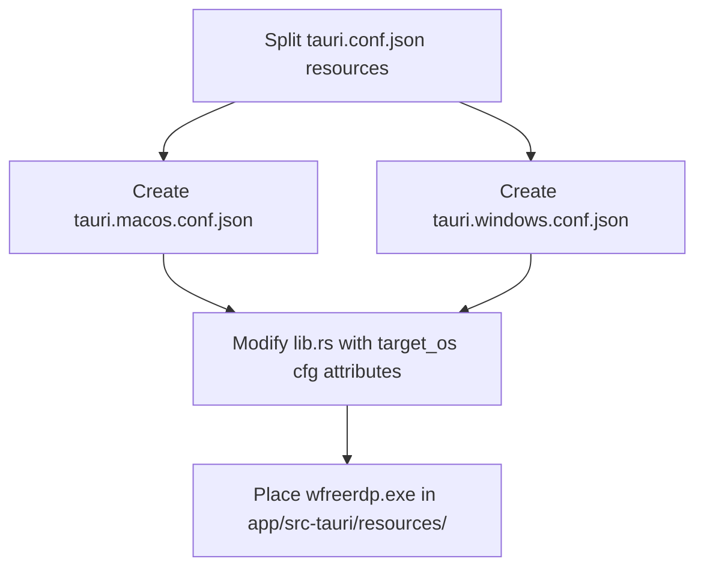

# Windows Support Implementation Plan

This plan details how to add Windows platform support to the GEWIS Remote Desktop application, enabling compiling and packaging for both macOS and Windows.

---

## 1. Architectural Differences

| Component | macOS | Windows |
| :--- | :--- | :--- |
| **RDP Client** | Custom built `sdl-freerdp` (SDL3 + Metal, VideoToolbox) | Standard `wfreerdp.exe` (Win32 + DXVA) |
| **Kerberos Auth** | Uses Unix `kinit` to cache tickets in `FILE:/tmp/krb5cc_gewis_rdp` | Handled natively by Windows SSPI (no `kinit` or ticket cache file required) |
| **Packaging Target** | `.app` bundled in a custom `.dmg` | `.exe` installer via NSIS |

---

## 2. Configuration Adjustments

### A. Split `tauri.conf.json` Resources
To keep macOS-specific dynamic libraries out of the Windows build and vice-versa, we will move platform-specific settings to:
1. `app/src-tauri/tauri.macos.conf.json` — holds the macOS `.dylib` files and minimum macOS system version.
2. `app/src-tauri/tauri.windows.conf.json` — holds the `wfreerdp.exe` resource and configures the NSIS installer target.
3. `app/src-tauri/tauri.conf.json` — cleaned up to remove macOS-specific fields under `bundle`.

---

## 3. Rust Backend Adjustments (`app/src-tauri/src/lib.rs`)

We will conditionally compile platform-specific code using `#[cfg(target_os = "macos")]` and `#[cfg(target_os = "windows")]`:

### A. Helper functions
* **`brew_prefix()`**: Compile only on macOS since Windows does not use Homebrew.
* **`freerdp_path()`**: Resolve `sdl-freerdp` on macOS or `wfreerdp.exe` on Windows.

### B. `run_connect()` flow
* **Kerberos initialization**: Wrap the `kinit` step with `#[cfg(target_os = "macos")]`.
* **Command Spawning**: Set macOS-specific environment variables (`KRB5CCNAME`, `SDL_VIDEO_MAC_FULLSCREEN_SPACES`) only when compiling for macOS.

---

## 4. Implementation Steps



### Proposed Changes

#### 1. Main configuration: `app/src-tauri/tauri.conf.json`
```json
{
  "productName": "GEWIS Remote Desktop",
  "version": "1.1.0",
  "identifier": "nl.gewis.rdp",
  "build": {
    "frontendDist": "../src"
  },
  "bundle": {
    "active": true,
    "icon": [
      "icons/32x32.png",
      "icons/128x128.png",
      "icons/128x128@2x.png",
      "icons/icon.icns",
      "icons/icon.ico"
    ]
  },
  "app": {
    "withGlobalTauri": true,
    "windows": [
      {
        "title": "",
        "width": 320,
        "height": 500,
        "resizable": false,
        "titleBarStyle": "Overlay",
        "hiddenTitle": true
      }
    ],
    "security": {
      "csp": null
    }
  }
}
```

#### 2. macOS Overrides: `app/src-tauri/tauri.macos.conf.json`
```json
{
  "bundle": {
    "targets": ["app"],
    "resources": [
      "resources/sdl-freerdp",
      "resources/libfreerdp-client3.3.dylib",
      "resources/libfreerdp3.3.dylib",
      "resources/libwinpr3.3.dylib",
      "resources/libSDL3.0.dylib",
      "resources/libSDL3_ttf.0.dylib"
    ],
    "macOS": {
      "minimumSystemVersion": "11.0"
    }
  }
}
```

#### 3. Windows Overrides: `app/src-tauri/tauri.windows.conf.json`
```json
{
  "bundle": {
    "targets": ["nsis"],
    "resources": [
      "resources/wfreerdp.exe"
    ]
  }
}
```

#### 4. Backend logic: `app/src-tauri/src/lib.rs` (Key edits)
```rust
// Only compile brew_prefix on macOS
#[cfg(target_os = "macos")]
fn brew_prefix() -> Result<String, String> {
    for prefix in &["/opt/homebrew", "/usr/local"] {
        if Path::new(&format!("{}/bin/brew", prefix)).exists() {
            return Ok(prefix.to_string());
        }
    }
    Err("Homebrew not found. Install it from https://brew.sh".into())
}

// OS-specific path resolution
fn freerdp_path(app: &tauri::AppHandle) -> Result<String, String> {
    #[cfg(target_os = "macos")]
    {
        if let Ok(dir) = app.path().resource_dir() {
            let p = dir.join("resources").join("sdl-freerdp");
            if p.is_file() {
                return Ok(p.to_string_lossy().into());
            }
        }
        let p = format!("{}/opt/freerdp-krb5/bin/sdl-freerdp", home());
        if Path::new(&p).exists() {
            return Ok(p);
        }
        Err("FreeRDP not found. Please reinstall the app.".into())
    }
    #[cfg(target_os = "windows")]
    {
        if let Ok(dir) = app.path().resource_dir() {
            let p = dir.join("resources").join("wfreerdp.exe");
            if p.is_file() {
                return Ok(p.to_string_lossy().into());
            }
        }
        let p = "C:\\Program Files\\FreeRDP\\wfreerdp.exe";
        if Path::new(p).exists() {
            return Ok(p.into());
        }
        Err("FreeRDP (wfreerdp.exe) not found. Please place wfreerdp.exe in resources.".into())
    }
}
```
